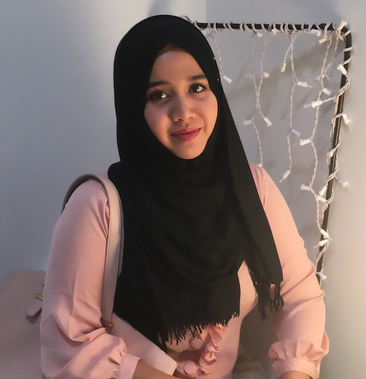

- **When:** Monday, Oct. 21, 14:20-17:40pm
- **Where:** Vancouver, BC, Canada
- **Contact Us:** `vis4good-org@googlegroups.com`

_Disclaimer: must be registered for [IEEE VIS 2019](http://ieeevis.org) to attend_

### Why a _Vis for Social Good_ Tutorial?
We believe that visualization researchers, teachers, and practitioners can and _should_ use the explanatory and persuasive power of visualizations to promote social good in their communities and the wider world.

Unfortunately, the skills required to make these impacts are often excluded from standard visualization curricula, requiring considerations of presenting data to diverse audiences, working with uncertain data sources, and examining the ethical impacts of data collection and analysis.

### What is the _Vis for Social Good_ Tutorial?
Hosted by [IEEE VIS 2019](http://ieeevis.org), this half-day tutorial will collaboratively address the visualization challenges of social issues that attendees feel passionately about. Organizers will provide lightning-talks on visualization's social impact, ethics, and evaluation. Together, attendees and organizers will work with their complementary skillsets to contribute to social issue through a novel visualization, a novel dataset, or a new perspective on an existing problem.

### Schedule
- _2:20 - 2:35_: **Welcome** (Leilani Battle)
- _2:35 - 2:45_: Get to know each other + brainstorm topics
- _2:45 - 2:55_: **Lightning Talk: Visualization for Advocacy** (Michael Correll)
- _2:55 - 3:15_: Activity 1
- _3:15 - 3:25_: **Lightning Talk: Trust and Platforms - Barriers to Impact** (Evan Peck)
- _3:25 - 3:50_: Critique Activity 2
- _Break_
- _4:10 - 4:25_: Report back (Activity 2)
- _4:25 - 4:35_: **Lightning Talk: Design Considerations for Social Good** (Lane Harrison)
- _4:35 - 5:00_: Design Activity 3
- _5:00 - 5:15_: Report back (Activity 3)
- _5:15 - 5:25_: **Lightning Talk: Service Learning in Visualization** (Uzma Haque Syeda)
- _5:25 - 5:35_: Wrap up

### Organizers

<a href="https://www.cs.umd.edu/~leilani">

  
  
Leilani Battle

  
University of Maryland

  

  Leilani Battle is an Assistant Professor at the University of Maryland, College Park, with a joint appointment in the University of Maryland Institute for Advanced Computer Studies (UMIACS). She is also affiliated with the UMD Human-Computer Interaction Laboratory (HCIL). Her research interests focus on developing interactive data-intensive systems that can aid analysts in performing complex data exploration and analysis. Her current research is anchored in the field of databases, but utilizes research methodology and techniques from HCI and visualization to integrate data processing (databases) with interactive interfaces (HCI, visualization).
  

</a>

<a href="https://www.khoury.northeastern.edu/people/michelle-borkin/">

  
  
Michelle Borkin

  
Northeastern University

  

    Michelle Borkin is an Assistant Professor in the Khoury College of Computer Sciences at Northeastern University. Her research focuses on the development of visualization techniques and tools to enable new insights and discoveries in data across disciplines, informed and enhanced through the evaluation of perception and cognition theory. She is also passionate about broadening participation in visualization, and teaching visualization through a Service-Learning model which engages students with their local community and empowers them to use their visualization skills for social good.
  

</a>

<a href="http://correll.io/">

  
  
Michael Correll

  
Tableau Research

  

    Michael Correll is a research scientist at Tableau Software. His research focuses on the presentation of statistical information to audiences without statistical backgrounds. As part of this work he also focuses on the ethical implications of visualization work, and blogs about using data visualization for advocacy and social good. He also focuses on techniques for visualizing uncertainty and communicating uncertain data to wider audiences.
  

</a>

<a href="https://web.cs.wpi.edu/~ltharrison/">

  
  
Lane Harrison

  
Worcester Polytechnic Institute

  

    Lane Harrison is an assistant professor at Worcester Polytechnic Institute. His research centers on measuring how audiences read and interact with visualizations, including graphical perception studies, and studies involving popular interactive visualizations on the web.
  

</a>

<a href="https://www.eg.bucknell.edu/~emp017/">

  
  
Evan Peck

  
Bucknell University

  

    Evan Peck is an Assistant Professor of Computer Science at Bucknell University.  He has been broadly active in integrating ethical design into introductory CS courses, including running a workshop at SIGCSE 2019, curating and writing about ethical CS modules, and serving as a judge in \textit{The Responsible CS Challenge}. His recent research acts as an extension of these interests - focusing on the communication of data to underrepresented populations in rural Pennsylvania.
  

</a>

<a href="https://www.khoury.northeastern.edu/people/uzma-haque-syeda/">

  
  
Uzma Haque Syeda

  
Northeastern University

  

    Uzma Haque Syeda is a PhD. student at Northwestern University with a concentration in data visualization.
  

</a>

### Code of Conduct
IEEE VIS is committed to providing an inclusive and harassment-free environment in all interactions regardless of gender, sexual orientation, disability, physical appearance, race, or religion. This commitment extends to all IEEE VIS sponsored events and services (webinars, committee meetings, networking functions, online forums, chat rooms, and social media) and any interaction regardless of affiliation or position. As a community that aims to share ideas and freedom of thought and expression, it is essential that the interaction between attendees take place in an environment that recognizes the inherent worth of every person by being respectful of all. IEEE VIS does not tolerate harassment in any form. Harassment is any form of behavior intended to exclude, intimidate, or cause discomfort. Harassment includes, but is not limited to, the use of abusive or degrading language, intimidation, stalking, harassing photography or recording, inappropriate physical contact, and unwelcome sexual attention.

Anyone who experiences, observes, or has knowledge of threatening behavior is encouraged to immediately report the incident to ombuds@ieeevis.org. All information shared will be kept confidential. In cases where a public response is deemed necessary, the identities of victims and reporters will remain confidential unless those individuals consent otherwise.

IEEE VIS reserves the right to take appropriate action to foster an inclusive and respectful environment. Attendees violating these rules may be asked to leave the conference without a refund, at the sole discretion of the conference organizers. In addition, attendees are subject to the [IEEE Code of Ethics](https://www.ieee.org/about/corporate/governance/p7-8.html).

#### Contact
Please contact ombuds@ieeevis.org if you experience, observe, or have knowledge of behavior in violation of the Code of Conduct.

Please contact inclusivity@ieeevis.org with any questions about the Code of Conduct and Inclusivity & Diversity at IEEE VIS.
