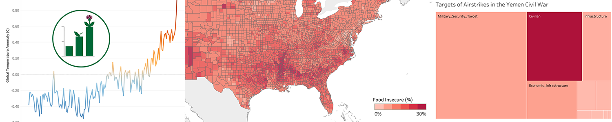

### NEW FOR 2020: We will be hosting a virtual panel this year!

- **When:** 10-1130am MDT (12-130p EST) Friday, Oct 30 2020
- **Where:** Virtual VIS 2020
- **Contact Us:** `vis4good-org@googlegroups.com`

_Disclaimer: must be registered for [IEEE VIS 2020](http://ieeevis.org) to attend (free for general attendees!)_

### Why a _Vis for Social Good_ Panel?

**What role (if any) should data visualization play in effecting positive change in the world?**

There is a growing "techlash" that highlights the potential of data science (and data visualization) as tools for reinforcing structures of inequality and injustice. 

We envision this panel to function as a way of airing these competing viewpoints and providing guidance on how the visualization community should use their power and responsibilities in the world. 

### Panelists

  
Catherine D'Ignazio

  
Massachussets Institute of Technology

<a href="/panelists/dignazio">
  
bio | statement

</a>
  

  Catherine D’Ignazio is a hacker mama, scholar, and artist/designer who focuses on feminist technology, data literacy and civic engagement. She has run women’s health hackathons, designed global news recommendation systems, created talking and tweeting water quality sculptures, and led walking data visualizations to envision the future of sea level rise. Her 2020 book from MIT Press, Data Feminism, co-authored with Lauren Klein, charts a course for more ethical and empowering data science practices. D’Ignazio is an assistant professor of Urban Science and Planning in the Department of Urban Studies and Planning at MIT where she is the Director of the Data + Feminism Lab.
  

  
Ronald Metoyer

  
University of Notre Dame

<a href="/panelists/metoyer">
  
bio | statement

</a>
  

    Ronald Metoyer is an Associate Professor of Computer Science and Engineering at the University of Notre Dame.  He earned his B.S. in Computer Science and Engineering at the University of California, Los Angeles (1994) and his Ph.D. in Computer Science from the Georgia Institute of Technology (2002).  His primary research interest is in human-computer interaction and information visualization, with a focus on multivariate data visualization, decision making, and narrative.  He has published over 60 papers and is the recipient of a 2002 NSF CAREER Award.  He also serves as Associate Dean in the College of Engineering at the University of Notre Dame.
  

  
Michelle Borkin

  
Northeastern University

<a href="/panelists/borkin">
  
bio | statement

</a>
  

    Michelle Borkin works on the development of novel visualization techniques and tools to enable new insights and discoveries in data. Her research spans visualization and human-computer interaction with interests across disciplines including astronomy and physics, medical imaging, network visualization, perception and cognition, and accessibility.  Michelle Borkin is an Assistant Professor in the Khoury College of Computer Sciences at Northeastern University.  She received her Ph.D. in Applied Physics from Harvard’s School of Engineering and Applied Sciences in 2014, as well as an M.S. in Applied Physics and a B.A. in Astronomy \& Physics from Harvard University. She was previously a National Science Foundation graduate research fellow, a National Defense Science and Engineering graduate fellow, and a TED fellow.  She is also recipient of a CHI 2020 Best Paper Award for the publication ``Design Study `Lite' Methodology: Expediting Design Studies and Enabling the Synergy of Visualization Pedagogy and Social Good''.
  

  
Evan Peck

  
Bucknell University

<a href="/panelists/peck">
  
bio | statement

</a>
  

    Evan Peck is an Associate Professor of Computer Science at Bucknell University. Evan's research sits at the intersection of HCI and Visualization, broadly exploring how technology can empower diverse groups of people to understand their world through data. Recently, his visualization work interviewing community members in rural Pennsylvania was the recipient of a 2019 CHI Best Paper Award. Evan also acts as an advocate for ethical approaches in core engineering curriculum. His curricular development pairs issues of bias, fairness, and social impact directly with technical content (\url{https://ethicalcs.github.io/}), and has been adopted by universities across the country. Finally, Evan serves as a member of ACM SIGCHI's Research Ethics Committee. He earned his Ph.D. in 2014 in Computer Science from Tufts University. 
  

### Schedule

Join us from 10:00am - 11:30am MDT. 

Register for free at [http://ieeevis.org/year/2020/info/registration/conference-registration](http://ieeevis.org/year/2020/info/registration/conference-registration).

* 10:00-10:05: Introduction by panel organizers
* 10:05-10:35: Position statements by panelists (5 minutes per panelist)
* 10:35-11:25: Dialogue and Q&A
* 11:25-11:30: Wrap-up by panel organizers

### Organizers

<a href="https://www.cs.umd.edu/~leilani">

  
  
Leilani Battle

  
University of Maryland

  

  Leilani Battle is an Assistant Professor at the University of Maryland, College Park, with a joint appointment in the University of Maryland Institute for Advanced Computer Studies (UMIACS). She is also affiliated with the UMD Human-Computer Interaction Laboratory (HCIL). Her research interests focus on developing interactive data-intensive systems that can aid analysts in performing complex data exploration and analysis. Her current research is anchored in the field of databases, but utilizes research methodology and techniques from HCI and visualization to integrate data processing (databases) with interactive interfaces (HCI, visualization).
  

</a>

<a href="https://www.khoury.northeastern.edu/people/michelle-borkin/">

  
  
Michelle Borkin

  
Northeastern University

  

    Michelle Borkin is an Assistant Professor in the Khoury College of Computer Sciences at Northeastern University. Her research focuses on the development of visualization techniques and tools to enable new insights and discoveries in data across disciplines, informed and enhanced through the evaluation of perception and cognition theory. She is also passionate about broadening participation in visualization, and teaching visualization through a Service-Learning model which engages students with their local community and empowers them to use their visualization skills for social good.
  

</a>

<a href="http://correll.io/">

  
  
Michael Correll

  
Tableau Research

  

    Michael Correll is a research scientist at Tableau Software. His research focuses on the presentation of statistical information to audiences without statistical backgrounds. As part of this work he also focuses on the ethical implications of visualization work, and blogs about using data visualization for advocacy and social good. He also focuses on techniques for visualizing uncertainty and communicating uncertain data to wider audiences.
  

</a>

<a href="https://web.cs.wpi.edu/~ltharrison/">

  
  
Lane Harrison

  
Worcester Polytechnic Institute

  

    Lane Harrison is an assistant professor at Worcester Polytechnic Institute. His research centers on measuring how audiences read and interact with visualizations, including graphical perception studies, and studies involving popular interactive visualizations on the web.
  

</a>

<a href="https://www.eg.bucknell.edu/~emp017/">

  
  
Evan Peck

  
Bucknell University

  

    Evan Peck is an Assistant Professor of Computer Science at Bucknell University.  He has been broadly active in integrating ethical design into introductory CS courses, including running a workshop at SIGCSE 2019, curating and writing about ethical CS modules, and serving as a judge in \textit{The Responsible CS Challenge}. His recent research acts as an extension of these interests - focusing on the communication of data to underrepresented populations in rural Pennsylvania.
  

</a>

### Code of Conduct
IEEE VIS is committed to providing an inclusive and harassment-free environment in all interactions regardless of gender, sexual orientation, disability, physical appearance, race, or religion. This commitment extends to all IEEE VIS sponsored events and services (webinars, committee meetings, networking functions, online forums, chat rooms, and social media) and any interaction regardless of affiliation or position. As a community that aims to share ideas and freedom of thought and expression, it is essential that the interaction between attendees take place in an environment that recognizes the inherent worth of every person by being respectful of all. IEEE VIS does not tolerate harassment in any form. Harassment is any form of behavior intended to exclude, intimidate, or cause discomfort. Harassment includes, but is not limited to, the use of abusive or degrading language, intimidation, stalking, harassing photography or recording, inappropriate physical contact, and unwelcome sexual attention.

Anyone who experiences, observes, or has knowledge of threatening behavior is encouraged to immediately report the incident to ombuds@ieeevis.org. All information shared will be kept confidential. In cases where a public response is deemed necessary, the identities of victims and reporters will remain confidential unless those individuals consent otherwise.

IEEE VIS reserves the right to take appropriate action to foster an inclusive and respectful environment. Attendees violating these rules may be asked to leave the conference without a refund, at the sole discretion of the conference organizers. In addition, attendees are subject to the [IEEE Code of Ethics](https://www.ieee.org/about/corporate/governance/p7-8.html).

#### Contact
Please contact ombuds@ieeevis.org if you experience, observe, or have knowledge of behavior in violation of the Code of Conduct.

Please contact inclusivity@ieeevis.org with any questions about the Code of Conduct and Inclusivity & Diversity at IEEE VIS.
