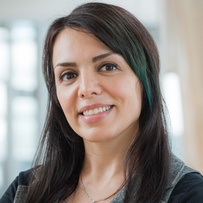

- **When:** Monday, October 23, 2023: 9:00 AM-12:00 PM AEDT (UTC+11)
- **Where:** VIS 2023, Melbourne Convention and Exhibition Centre, Melbourne, Australia
- **Contact Us:** `vis4good-org@googlegroups.com`, [@vis4good](https://twitter.com/vis4good)

### Welcome

We are proud to announce the third **Workshop on Visualization for Social Good** to be held as part of [IEEE VIS 2023](http://ieeevis.org/year/2023/welcome). The goal of this workshop is to:
- ***provide a central venue within the IEEE VIS community for surfacing work that critiques, defines, or explores the impact of data visualization on society in order to build just and equitable futures.***

Data is an inescapable part of our lives: it guides commerce, government, and technology, and increasingly determines what lives we can (or cannot) live. Data visualization has a special place within this emerging, data-driven, order: as a tool to inform or persuade mass audiences, guide or enlighten the specialist, or give a voice to the unheard. We therefore pose the question: how can visualization, and visualization research, help us build the worlds we want? This theme, building just and equitable futures, is the motivation behind the third edition of our recurring workshop at IEEE VIS: Visualization for Social Good. Our workshop series has been successful not only at showcasing high-quality socially-minded visualization research from diverse voices, but also in starting important conversations around the role of data visualization as a force for good in society at large. We invite you to join our workshop and growing community on Visualization for Social Good, to navigate conversations about the role of data in human dignity and flourishing.

### Schedule

| Time&nbsp;(AEDT) | Title | Speaker |
|:----------------:|--------------------------------------------------------------------------------------------------------|-------------------------------------------------------------------------------------------------------|
| **9:00-10:15** | **Paper Session 1** | | 
| 9:00-9:15 | **Introduction & Welcome** | | 
| 9:15-9:22| *[Empowering People with Intellectual and Developmental Disabilities through Cognitively Accessible Visualizations]()* | Keke Wu |
| 9:22-9:25| Q&A | |
| 9:25-9:32| *[The Good Life: visualizing the complexity of supported living for people with disability]()* | Georgina&nbsp;Hibberd |
| 9:32-9:35| Q&A | |
| 9:35-9:42| *[Beyond English: Centering Multilingualism in Data Visualization]()* | Noëlle&nbsp;Rakotondravony |
| 9:42-9:45| Q&A | |
| 9:45-9:52| *[From Flowchart to Questionnaire: Increasing Access to Justice via Visualization]()* | Bei&nbsp;Wang |
| 9:52-9:55| Q&A | |
| 9:55-10:02| *[Visual Salience to Mitigate Gender Bias in Recommendation Letters]()* | Emily&nbsp;Wall |
| 10:02-10:05| Q&A | |
| 10:05-10:12| *[Open Questions about the Visualization of Sociodemographic Data]()* | Florent&nbsp;Cabric |
| 10:12-10:15| Q&A | |
| 10:15-10:45 | **Break** | |
| **10:45-12:00** | **Paper Session 2 + Keynote** | | |
| 10:45-10:52| *[Supporting Mathematical Education with Interactive Visual Proofs]()* | Moritz&nbsp;Weckbecker |
| 10:52-10:55| Q&A | |
| 10:55-11:02| *[Bridging the Divide: Promoting Serendipitous Discovery of Opposing Viewpoints with Visual Analytics in Social Media]()* | Narges&nbsp;Mahyar |
| 11:02-11:05| Q&A | |
| 11:05-12:00| Keynote | TBD |
| 12:00 |  **Closing Remarks** | |
 

### Call for Papers

We as designers, researchers, and technologists, have many opportunities ahead of us, as laid out in aspirational plans like the [UN Sustainable Development Goals](https://sdgs.un.org/goals), the NAE [Grand Challenges for Engineering](http://www.engineeringchallenges.org/challenges.aspx), and the NSF [10 Big Ideas](https://www.nsf.gov/news/special_reports/big_ideas/). Yet, as the "techlash" continues, we are also seeing how technology has the power to magnify inequality, injustice, or other societal ills.

With the power that comes with collecting, interpreting, and communicating data in visualization, there is naturally a social *responsibility.* To do good and avoid harm, we should make our values as a field explicit, criticize and critique the work we do that has a potential for harm, develop a pedagogy around the socially responsible design and use of visualization, and develop good patterns for fruitful collaboration with stakeholders working on key societal problems.

To that end, we are soliciting work that deals with the social impact of visualization work. 
In order to focus the goals of our workshop, provide inspiration to potential attendees or submitters, and to reflect on the pressing issues of contemporary importance, we propose the following theme for the 2023 workshop: **building just and equitable futures**.

Some potential questions of interest include:
- How can we adapt our ways of teaching, designing, or intervening in the face of imminent widespread societal, technological, or environmental change?
- What audiences are included or excluded in our visualizations? How can data visualization be used to empower marginalized communities?
- What role can data visualization play in promoting transparency and accountability in public and private sector decision making, especially as decision-making becomes increasingly automated and data-driven?

#### Contributions
Potential contributions might include (but are not limited to):

- Design studies, "collaboration journals," or other best practices for visualization work in domains with high social impact. Examples include:
 - Public health, development, and sustainable growth
 - Inclusivity, accessibility, and disability rights
 - Diversity, racial equality, and gender equality
 - Sustainability, ecology, and environmental activism
- Explorations of design considerations for visualizations for mass audiences or policymakers. Examples include:
 - Building statistical or visualization literacy and fluency
 - Persuasion, misinformation, and deception
 - Accessibility
- Critiques, manifestos, or provocations around social or ethical responsibilities in visualization design or research

Consult our [resources page](resources), [2021 workshop](workshop2021), [2022 workshop](workshop2022) for sample works.

#### Submissions

Papers will be *up to four pages, plus up to one page of references*, in [VGTC two-column format](https://tc.computer.org/vgtc/publications/conference/). Authors may elect to have their paper included archivally, or, per the authors' request (e.g., for in-progress work), to have the work be presented but excluded from formal conference proceedings. The deadline for paper submissions is *July 03, 2023*.

### Important Dates

- **Submission Deadline:** ~~July 3, 2023~~ **July 10, 2023** (no separate abstract deadline)
- **Notification: August 1, 2023**
- **Submission of Camera-Ready Final Version: August 15, 2023**

All deadlines are at **11:59pm (23:59) AoE Anywhere on Earth (AoE)**.

### Program Committee

- **Catherine D'Ignazio**, MIT
- **Sean McGregor**, Syntiant, Partnership on AI, XPrize Foundation
- **Ab Mosca**, Northeastern University
- **Doug Markant**, UNC Charlotte
- **Ryan Wesslen**, UNC Charlotte
- **Priya Dhawka**, University of Calgary
- **Natkamon Tovanich**, École Polytechnique
- **Georgia Panagiotidou**, University College London
- **Mahmood Jasim**, UMass Amherst
- **Alyx Burns**, Mount Holyoke College
- **Zack While**, UMass Amherst
 

### Organizers

<a href="https://www.evanthiadimara.com/home">

 
 
Evanthia Dimara

 
Utrecht University

 

  Evanthia Dimara is an Assistant Professor of Computer Science at Utrecht University. Her fields of research are Information Visualization and HCI. Her research focuses on decision making --- to determine how technology can aid people to make impartial and informed decisions individually or as a group
 

</a>

<a href="https://uzma0804.github.io/syeda/">

 
 
Uzma Haque Syeda

 
Northeastern University

 

  Uzma Haque Syeda is a fifth-year Ph.D. Student in the Khoury College of Computer Sciences at Northeastern University. She holds a B.Sc. in Electrical and Electronic Engineering from the University of Dhaka, Bangladesh, and an M.S. in Computer Science from Northeastern University. Her research focuses on bridging the gap between visualization research and pedagogy by providing methodologies to teach and implement design studies with nonprofit organizations to facilitate social good. The aim of her research is to benefit both the learners and the research community.
 

</a>

<a href="https://groups.cs.umass.edu/nmahyar/">
  

   
   
Narges Mahyar

   
University of Massachusetts Amherst

   

  Narges Mahyar is an Assistant Professor in the College of Information and Computer Sciences at the University of Massachusetts Amherst. She holds a PhD in Computer Science from the University of Victoria, an MS in Information Technology from the University of Malaya, and a BS in Electrical Engineering from Tehran Azad University. Her Ph.D. was funded by SAP Business Objects for four years, where she worked closely with SAP experts and research team to develop novel technologies for collaborative visual analytics tasks.
  
   

  

  </a>

<a href="https://research.monash.edu/en/persons/delvin-varghese">

 
 
 Delvin Varghese

 
Monash University

 

  Delvin Varghese is a Research Fellow within Action Lab in the Department of Human-Centred Computing at Monash University. His research focuses on the design of technologies for nonprofits and community organizations to support community voice and inclusion, including recent domains such as community welfare, peer mentoring of rural volunteers, providing technological support for individuals released from prison, and ICTD in Bangladesh.
 

</a>

<a href="https://emilywall.github.io/">
  

   
   
Emily Wall

   
Emory University

   

   I am an Assistant Professor in the Department of Computer Science at Emory University. My students and I make up CAV Lab where we focus on cognition and visualization. I completed my Ph.D. in Computer Science at Georgia Tech in 2020 and was a postdoctoral researcher at Northwestern University 2020-2021.
   

  

  </a>

### Steering Committee 

- **[Evan Peck](https://www.eg.bucknell.edu/~emp017/)**, University of Colorado - Boulder
- **[Michael Correll](http://correll.io/)**, Tableau Software
- **[Michelle Borkin](https://www.khoury.northeastern.edu/people/michelle-borkin/)**, Northeastern University
- **[Lane Harrison](https://web.cs.wpi.edu/~ltharrison/)**, Worcester Polytechnic Institute
- **[Leilani Battle](https://homes.cs.washington.edu/~leibatt/bio.html)**, University of Washington
