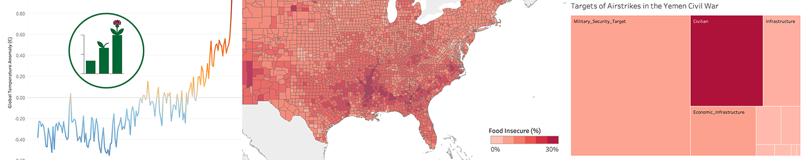

- **When:** Sunday 16 October 2022 2-5pm CDT (UTC-5)
- **Where:** VIS 2022 at Oklahoma Station 8
- **Contact Us:** `vis4good-org@googlegroups.com`, [@vis4good](https://twitter.com/vis4good)

### Welcome

We are proud to announce the second **Workshop on Visualization for Social Good** to be held as part of [IEEE VIS 2022](http://ieeevis.org/year/2022/welcome). The goal of this workshop is to:
- ***provide a central venue within the IEEE VIS community for surfacing work that critiques, defines, or explores the impact of data visualization on society.***

There are many ways that work in visualization can have immediate social impact--- working closely with community stakeholders, exploring how to present data for mass audiences, evaluating the potential of visualization for advocacy or as a tool to shape public policy--- all have the potential to reshape society for the better. Thoughtfulness, reflection, and critique are likewise important to build up a clear picture of both the potential benefits and potential harms of visualization research.

The Visualization for Social Good Workshop (Vis4Good) aims to provide a central venue within the IEEE VIS community for surfacing work that critiques, defines, or explores the impact of data visualization on society. Through a blend of paper sessions, invited presentations, and break-out groups, we hope that the inaugural Vis4Good 2022 Workshop encourages attendees to harness visualization research to tackle critical challenges in responsible AI, clean energy, human health and well-being, and other domain areas with critical societal impact.

### Schedule

| Time(CDT) &nbsp;&nbsp;&nbsp;&nbsp;&nbsp;&nbsp;&nbsp;&nbsp;&nbsp;&nbsp; | | |
|:----------------:|--------------------------------------------------------------------------------------------------------|-------------------------------------------------------------------------------------------------------|
| 2:00-2:15 | **Introduction & Welcome, Paper Session** | | |
| | *[Additional Perspectives on Data Equity](papers/2022/schwabish.pdf)* | Jonathan Schwabish, Alice Feng, Wesley Jenkins |
| | *[Exploring and Explaining Climate Change: Exploranation as a Visualization Pedagogy for Societal Action](papers/2022/besancon.pdf)* | Lonni Besançon, Konrad J Schönborn, Erik Sundén, Yin He, Samuel Rising, Peter Westerdahl, Patric Ljung, Josef Wideström, Charles Hansen, Anders Ynnerman |
| | *[Envisioning Situated Visualizations of Environmental Footprints in an Urban Environment](papers/2022/jansen.pdf)* | Yvonne Jansen, Federica Bucchieri, Pierre Dragicevic, Martin Hachet, Morgane Koval, Léana Petiot, Arnaud Prouzeau, Dieter Schmalstieg, Lijie Yao, Petra Isenberg |
| | *[Can data visualizations change minds? Identifying mechanisms of elaborative thinking and persuasion](papers/2022/markant.pdf)* | Douglas Markant, Milad Rogha, Alireza Karduni, Ryan Wesslen, Wenwen Dou |
| | *[Representing Marginalized Populations: Challenges in Anthropographics](papers/2022/dhawka.pdf)* | Priya Dhawka, Helen Ai He, Wesley Willett |
| | *[Data Bricks Space Mission: Teaching Kids about Data with Physicalization](papers/2022/ambrosini.pdf)* | Lorenzo Ambrosini, Miriah Meyer |
| 3:15-3:45 | **Break** | |
| 3:45-5:00 | **Paper Session 2 & Break-out Session** | |
| | *[Ten Challenges and Explainable Analogs of growth functions and distributions for statistical literacy and fluency](papers/2022/hattab.pdf)* | Georges Hattab |
| | *[(Poster Paper) Teaching Data Visualization for Social Impact](papers/2022/tuzcu.pdf)* | Nil Tuzcu |
| | *Break-out Session: Brainstorming Visualization for Social Good* | Vis4Good attendees and community |
| 5:00 | **Closing Remarks** | |

### Call for Papers

We as designers, researchers, and technologists, have many opportunities ahead of us, as laid out in aspirational plans like the [UN Sustainable Development Goals](https://sdgs.un.org/goals), the NAE [Grand Challenges for Engineering](http://www.engineeringchallenges.org/challenges.aspx), and the NSF [10 Big Ideas](https://www.nsf.gov/news/special_reports/big_ideas/). Yet, as the "techlash" continues, we are also seeing how technology has the power to magnify inequality, injustice, or other societal ills.

With the power that comes with collecting, interpreting, and communicating data in visualization, there is naturally a social *responsibility.* To do good and avoid harm, we should make our values as a field explicit, criticize and critique the work we do that has a potential for harm, develop a pedagogy around the socially responsible design and use of visualization, and develop good patterns for fruitful collaboration with stakeholders working on key societal problems.

To that end, we are soliciting work that deals with the social impact of visualization work. 
In order to focus the goals of our workshop, provide inspiration to potential attendees or submitters, and to reflect on the pressing issues of contemporary importance, we propose the following theme for the 2022 workshop: **pedagogy**, **process**, and **protest**.

- We have the potential to re-imagine visualization **pedagogy**: to build curricula that encourage closer connections with communities and public service, build up data literacy in crucial audiences, or to better integrate ethical practices and thinking in how we conceptualize visualization as a discipline.
- The **process** of designing, evaluating, or circulating visualizations takes on a special character and urgency when dealing with matters of social importance, or as part of collaborations and relationships between visualizations experts and mass audiences.
- Visualization can also act as a powerful tool for advocacy and **protest**: charts and graphs can place inequality or inequity in stark relief, and can act as a persuasive in a world that strives to be “data-driven.”' However, visualization designers themselves, through resistance or refusal, can comment on the unequal ways that data are collected, presented, or organized in our society.

#### Contributions
Potential contributions might include (but are not limited to):

- Design studies, "collaboration journals," or other best practices for visualization work in domains with high social impact. Examples include:
 - Public health, development, and sustainable growth
 - Inclusivity, accessibility, and disability rights
 - Diversity, racial equality, and gender equality
 - Sustainability, ecology, and environmental activism
- Explorations of design considerations for visualizations for mass audiences or policymakers. Examples include:
 - Building statistical or visualization literacy and fluency
 - Persuasion, misinformation, and deception
 - Accessibility
- Critiques, manifestos, or provocations around social or ethical responsibilities in visualization design or research

Consult our [resources page](resources) and [2021 workshop](workshop2021) for sample works.

#### Submissions

Papers will be *up to four pages, plus up to one page of references*, in [VGTC two-column format](https://tc.computer.org/vgtc/publications/conference/). Authors may elect to have their paper included archivally, or, per the authors' request (e.g., for in-progress work), to have the work be presented but excluded from formal conference proceedings. The deadline for paper submissions is *July 20*.

Authors also have the option to submit a *2-page abstract for a poster* to be presented at the workshop. Poster abstracts follow the same format as paper submissions and will not be archived. The deadline for poster submissions is *September 7*.

Paper and poster submissions will be made via [PCS](https://new.precisionconference.com/submissions) and single-blind reviewed by the program committee.

### Important Dates

- ~~July 25: Workshop paper submissions deadline~~
- ~~August 19: Reviews due~~
- ~~August 22: Workshop paper notifications~~
- ~~August 29: Camera-ready paper deadline~~
- ~~September 7: Poster submission deadline~~
- ~~September 14: Poster notifications~~
- October 16: Workshop date

### ~~Keynote~~ (Cancelled) 

<figure class="keynote-item">
 
   <figcaption class="caption">Jer Thorp   Artist, Writer, Educator </figcaption>
</figure>

**Time, Space and Place: How to Break All Of Data's Rules**

In this presentation, Jer Thorp will share a decade’s worth of work that seeks to break down the rules we have built for data representation, and the rigid demands we’ve put on our audiences. Starting with static visualization and stretching to sculpture, performance and participatory art, Thorp will examine how refusing to comply with Tuftian standards might give data a chance to speak to wider audiences about complex topics.

### Program Committee

- **Alyxander Burns**, UMass Amherst
- **Vetria Byrd**, Purdue
- **Catherine D'Ignazio**, MIT
- **Mennatallah El-Assady**, University of Konstanz / Ontario University
- **Mi Feng**, Twitter
- **Lauren Klein**, Emory
- **Sean McGregor**, Syntiant, Partnership on AI, XPrize Foundation
- **Ab Mosca**, Tufts
- **Cathryn A Ploehn**, CMU
- **Paul Rosen**, USF
- **Manaswi Saha**, UW
- **Arvind Satyanarayan**, MIT
- **Jon Schwabish**, Urban Institute
- **Uzma Haque Syeda**, Northeastern

### Organizers

<a href="https://homes.cs.washington.edu/~leibatt/">

 
 
Leilani Battle

 
University of Washington

 

 Leilani Battle is an Assistant Professor in the Paul G. Allen Center of Computer Science and Engineering at the University of Washington. Her research interests focus on developing interactive data-intensive systems that can aid analysts in performing complex data exploration and analysis. Her current research is anchored in the field of databases, but utilizes research methodology and techniques from HCI and visualization to integrate data processing (databases) with interactive interfaces (HCI, visualization).
 

</a>

<a href="https://www.khoury.northeastern.edu/people/michelle-borkin/">

 
 
Michelle Borkin

 
Northeastern University

 

 Michelle Borkin is an Assistant Professor in the Khoury College of Computer Sciences at Northeastern University. Her research focuses on the development of visualization techniques and tools to enable new insights and discoveries in data across disciplines, informed and enhanced through the evaluation of perception and cognition theory. She is also passionate about broadening participation in visualization, and teaching visualization through a Service-Learning model which engages students with their local community and empowers them to use their visualization skills for social good.
 

</a>

<a href="https://emilywall.github.io/">

 
 
Emily Wall

 
Emory University

 

 I am an Assistant Professor in the Department of Computer Science at Emory University. My students and I make up CAV Lab where we focus on cognition and visualization. I completed my Ph.D. in Computer Science at Georgia Tech in 2020 and was a postdoctoral researcher at Northwestern University 2020-2021.
 

</a>

<a href="https://web.cs.wpi.edu/~ltharrison/">

 
 
Lane Harrison

 
Worcester Polytechnic Institute

 

 Lane Harrison is an assistant professor at Worcester Polytechnic Institute. His research centers on measuring how audiences read and interact with visualizations, including graphical perception studies, and studies involving popular interactive visualizations on the web.
 

</a>

<a href="https://groups.cs.umass.edu/nmahyar/">

 
 
Narges Mahyar

 
University of Massachusetts Amherst

 

Narges Mahyar is an Assistant Professor in the College of Information and Computer Sciences at the University of Massachusetts Amherst. She holds a PhD in Computer Science from the University of Victoria, an MS in Information Technology from the University of Malaya, and a BS in Electrical Engineering from Tehran Azad University. Her Ph.D. was funded by SAP Business Objects for four years, where she worked closely with SAP experts and research team to develop novel technologies for collaborative visual analytics tasks.

 

</a>

### Steering Committee 

- **[Evan Peck](https://www.eg.bucknell.edu/~emp017/)**, Bucknell University
- **[Michael Correll](http://correll.io/)**, Tableau Research